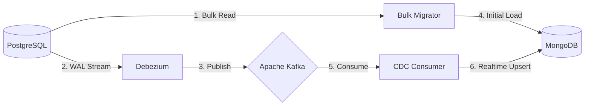

# PostgreSQL → MongoDB Migration Lab 🚀

A comprehensive, production-grade lab demonstrating a zero-downtime, large-scale database migration from PostgreSQL to MongoDB using an event-driven architecture.


## 📖 Table of Contents
- [Overview](#overview)
- [Architecture](#architecture)
- [Documentation Suite](#documentation-suite)
- [Quick Start](#quick-start)
- [Commands Reference](#commands-reference)
- [Monitoring & UI](#monitoring--ui)

## Overview

This project simulates a real-world enterprise database migration. It handles:
1. **Initial Historical Load**: Efficient chunk-based parallel migration of millions of records.
2. **Continuous Data Capture (CDC)**: Real-time synchronization of ongoing `INSERT`, `UPDATE`, and `DELETE` operations via WAL replication.
3. **Active Workloads**: Proves consistency even when the source database is under constant load during the migration.
4. **Resilience**: File-based checkpointing and Kafka offsets guarantee no data loss during component crashes.

## Architecture

The migration uses an event-driven approach to decouple extraction from loading, ensuring zero downtime on the source system.



## Documentation Suite

Dive deep into the technical design and internals of the system:

- 🏗️ **[System Design](docs/system-design.md)**: Goals, requirements, and scaling strategies for billions of records.
- 📐 **[Architecture Details](docs/architecture.md)**: Detailed breakdown of every component (Debezium, Schema Registry, Python modules).
- 🔄 **[Data Flow & Conflict Resolution](docs/data-flow.md)**: How race conditions are handled between Bulk Load and CDC.
- 🛡️ **[Failure Recovery](docs/failure-recovery.md)**: How the system self-heals from crashes and network partitions.
- ✅ **[Validation Strategy](docs/validation.md)**: The 7-point validation framework to mathematically prove consistency.

## Quick Start

The entire lab is containerized. **No local dependencies (Python, clients, etc.) are required—only Docker and Docker Compose.**

### 1. Start Infrastructure
```bash
make up
```
*Spins up PostgreSQL, MongoDB, Kafka, Schema Registry, Kafka Connect, and Kafka UI.*

### 2. Generate Initial Data (4 Million Records)
```bash
make generate-data
```
*Seeds PostgreSQL with realistic relational data.*

### 3. Setup Debezium Connector
```bash
make setup-connector
```
*Registers the PostgreSQL connector to start capturing WAL changes to Kafka.*

### 4. Start the Migration & Active Load
```bash
make start-migration
```
*This starts:*
- *`source-load-generator`: Continuously mutates data in PostgreSQL.*
- *`bulk-migrator`: Moves historical data.*
- *`cdc-consumer`: Applies real-time changes to MongoDB.*

### 5. Validate Consistency
```bash
make validate
```
*Runs the test suite to verify data parity between PostgreSQL and MongoDB.*

## Commands Reference

| Command | Description |
|---------|-------------|
| `make up` | Start core infrastructure |
| `make generate-data` | Seed source database |
| `make setup-connector` | Register Debezium CDC connector |
| `make start-migration` | Start bulk migration, CDC consumer, and load generator |
| `make stop-migration` | Stop the migration workers |
| `make validate` | Run consistency checks |
| `make failure-test` | Run automated chaos testing (crash/resume) |
| `make clean` | Stop everything and wipe all volumes/data |

## Monitoring & UI

- **Kafka UI**: [http://localhost:8080](http://localhost:8080) (Inspect topics, Avro schemas, and CDC messages in real-time)
- **Debezium API**: `http://localhost:8083/connectors`
- **Schema Registry**: `http://localhost:8081`
# migration-lab
