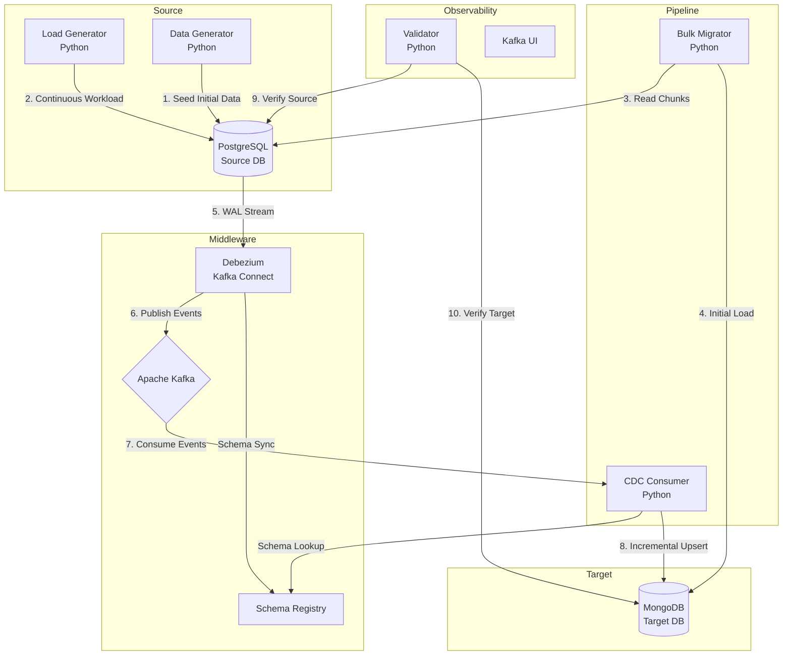

# Architecture

## 1. High-Level Architecture

The system uses an asynchronous, event-driven architecture designed for high throughput and fault tolerance.

## 2. Component Details

### 2.1. PostgreSQL Source
Configured with `wal_level=logical`. This is essential for Debezium to read the Write-Ahead Log via the `pgoutput` decoding plugin.

### 2.2. Debezium / Kafka Connect
Runs within a Kafka Connect Docker container. It monitors PostgreSQL tables and translates `INSERT`, `UPDATE`, and `DELETE` operations into standard event messages. It is configured to run in `snapshot.mode: never` because the initial load is handled by our optimized Bulk Migrator.

### 2.3. Kafka and Schema Registry
- **Apache Kafka** (KRaft mode): Acts as the durable buffer. It holds the CDC events if the consumer goes down, ensuring zero data loss.
- **Schema Registry**: Stores Avro schemas for the PostgreSQL tables. This drastically reduces the size of Kafka messages by only sending binary data and a schema ID, rather than full JSON schemas per message.

### 2.4. Python Application Components (Pure Docker)

All Python components are containerized and orchestrated via Docker Compose.

- **Data Generator (`data-generator`)**: Seeds the initial ~4,000,000 records across 5 tables respecting foreign keys.
- **Load Generator (`source-load-generator`)**: Simulates a live production environment by continuously executing mixed INSERT, UPDATE, and DELETE queries at a configurable operations-per-second (OPS) rate.
- **Bulk Migrator (`bulk-migrator`)**: Reads historical data in parallel chunks from PostgreSQL and writes to MongoDB. Implements file-based checkpointing for resumability.
- **CDC Consumer (`cdc-consumer`)**: Subscribes to Kafka topics, deserializes Avro messages using the Schema Registry, and performs idempotent upserts/deletes on MongoDB.
- **Validator (`validator`)**: Runs extensive checks (row counts, data sampling, hash comparisons) to mathematically prove the target matches the source.

### 2.5. MongoDB Target
Configured as a standalone replica set (required for transactions/CDC behavior if needed, and good practice). Target collections correspond directly to PostgreSQL tables.

## 3. Deployment Topology
The entire stack is defined in a single `docker-compose.yml`, abstracting away local dependencies. The host machine requires only Docker and Docker Compose. All components communicate over an isolated Docker bridge network.
