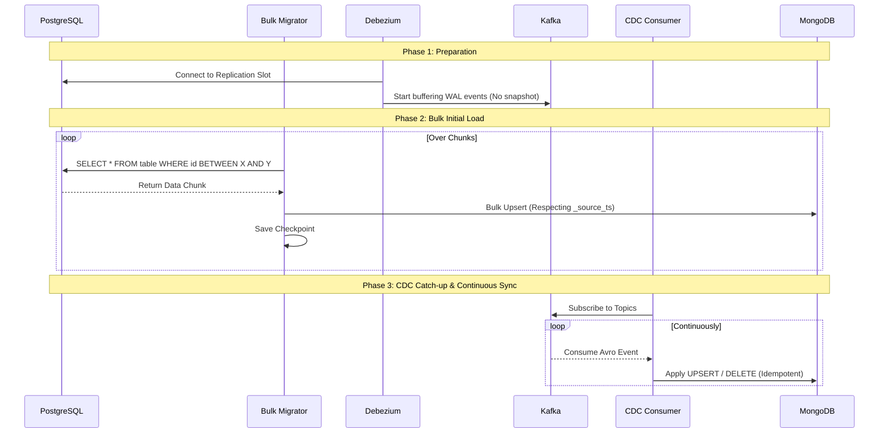

# Data Flow and Integration

This document outlines the step-by-step lifecycle of data flowing from the source to the target system.

## 1. Overall Migration Workflow

## 2. Bulk Migration Data Flow

1. **Chunk Calculation**: The Bulk Migrator queries `MIN(id)` and `MAX(id)` for a table. It divides this range into manageable chunks (e.g., 10,000 rows per chunk).
2. **Extraction**: A background worker fetches the chunk using an indexed SQL query.
3. **Transformation**: The PostgreSQL schema is mapped to a MongoDB document format. Date fields are converted to UTC strings/ISODates.
4. **Loading (Timestamp Guarded)**: 
   - A `_source_ts` timestamp is assigned to the document (derived from PostgreSQL `updated_at` or current time).
   - The migrator issues a bulk `ReplaceOne` operation to MongoDB with `upsert=True`.
   - **Critical Guard**: The query filter includes `$or: [{_source_ts: {$exists: false}}, {_source_ts: {$lte: source_ts}}]`. This ensures that if the CDC consumer has *already* written a newer version of this document, the bulk migrator will not overwrite it with stale data.
5. **Checkpointing**: Upon successful write, the chunk boundary is saved to a local JSON checkpoint file. If the container restarts, it resumes from the last successful chunk.

## 3. CDC (Continuous) Data Flow

1. **Transaction Commit**: An application (e.g., Load Generator) commits an `UPDATE` in PostgreSQL.
2. **WAL Decoding**: Debezium reads the WAL, decodes the logical change via `pgoutput`.
3. **Serialization**: Debezium formats the change payload, uses the Avro converter to serialize it, and registers the schema with Schema Registry.
4. **Publish**: The serialized byte array is published to a Kafka topic (e.g., `pgserver.public.orders`).
5. **Consumption**: The CDC Consumer Python app polls the Kafka topic.
6. **Deserialization**: It contacts the Schema Registry to resolve the schema ID and deserializes the Avro payload into a Python dictionary.
7. **Event Processing**:
   - `op == 'c'` (Create) or `op == 'u'` (Update): The consumer maps the `after` state of the row and performs an Upsert on MongoDB using the `_source_ts` extracted from the Debezium metadata (`source.ts_ms`).
   - `op == 'd'` (Delete): The consumer performs a `delete_one` on MongoDB based on the `before` state ID.
8. **Offset Commit**: Once successfully written to MongoDB, the consumer commits the Kafka offset, marking the message as safely processed.

## 4. Resolving Conflicts & Data Convergence

Because Debezium starts capturing events *before* the bulk load finishes, the target MongoDB will receive overlapping data.

### Scenario: Record Updated during Bulk Load

1. **T0**: Debezium starts listening.
2. **T1**: Record `id=5` is updated in PostgreSQL. Debezium puts `UPDATE(id=5, ts=T1)` on Kafka.
3. **T2**: CDC Consumer processes the Kafka message, writes document `id=5` to MongoDB with `_source_ts=T1`.
4. **T3**: Bulk Migrator reads chunk containing `id=5` from PostgreSQL. Because the query happens after T1, it reads the *new* state. It attempts to write `id=5` to MongoDB.
5. **MongoDB Engine**: Since Bulk Migrator has the latest state, the timestamp guard will succeed or overwrite gracefully (idempotency).

If the Bulk Migrator read the old state *before* T1, but wrote it *after* T2, the timestamp guard in MongoDB `_source_ts <= T1` will reject the stale Bulk Migrator write, preserving the newer CDC write.

This guarantees eventual consistency without taking the database offline.
